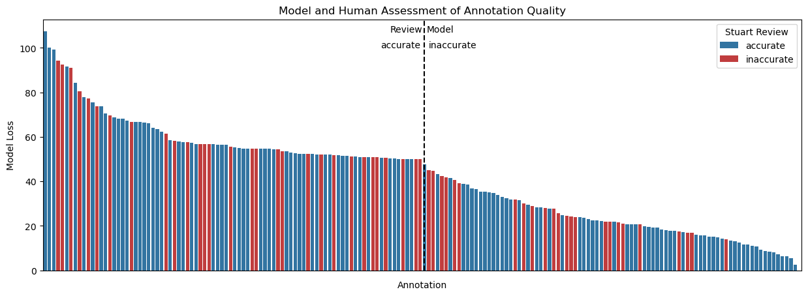

See 

Here is the result of comparing sf24s annotation review with what the model thinks might be an inaccurate annotation. The (current) model can not reliably distinguish accurate from inaccurate annotations. sf and the model agree more than random on what could be an inaccurate annotation. But think it is not enough to automatically remove those annotations from training if the model doesn't like them. (Cheating as ac called it.) We can reconduct the experiment later with an improved model, reusing sf24s annotation review, but at the moment I will just drop this feature, because it was the most complicated one to implement. I will remove the annotations which sf reviewed as 'inaccurate' from training.

